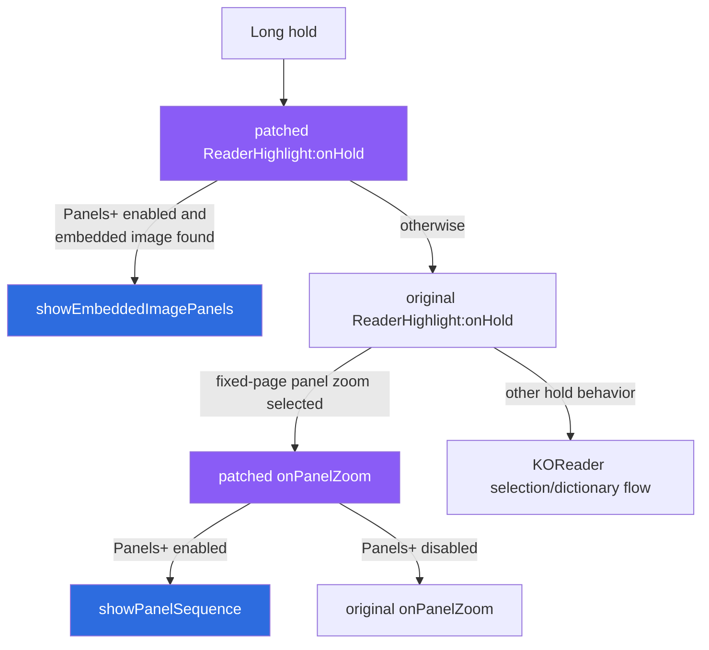
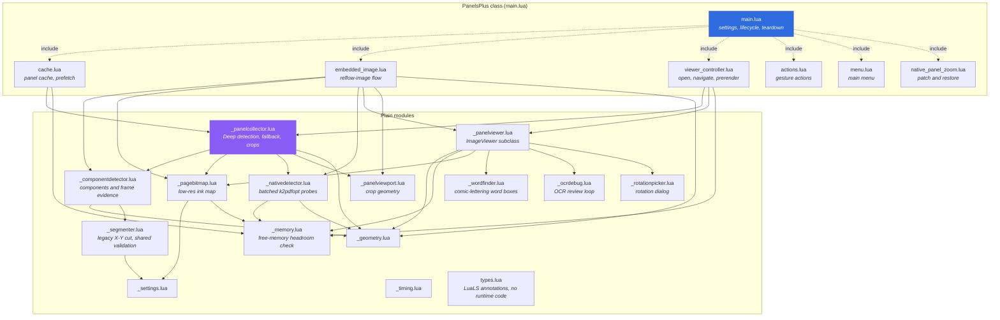
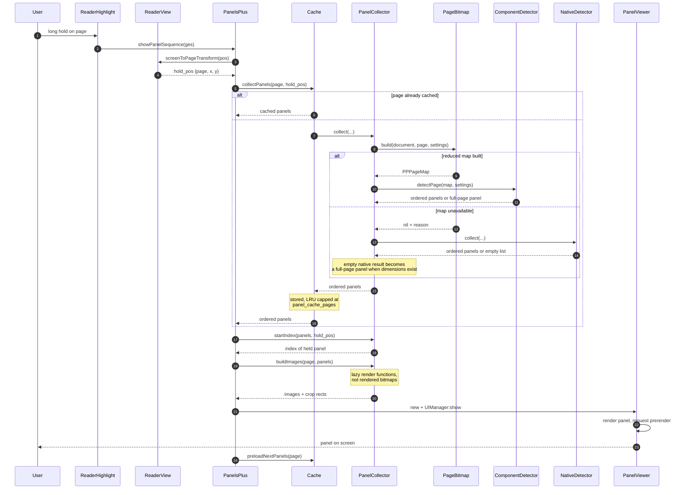
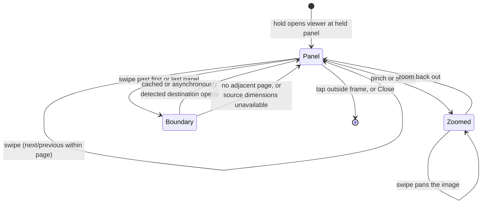
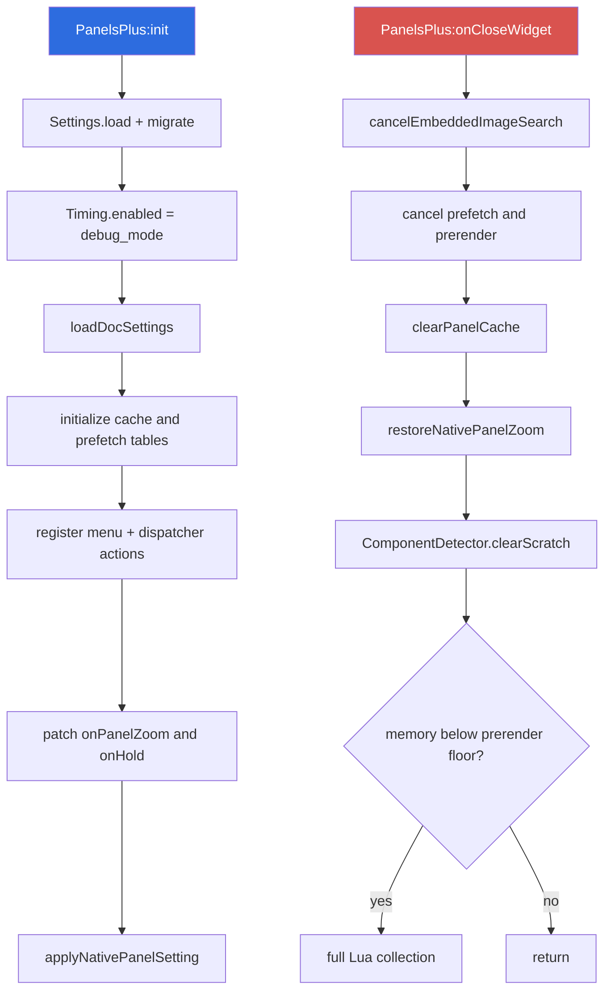

# Architecture

How Panels+ is put together, and what happens between a long-hold on a page and
a panel appearing on screen.

See also: [DETECTION.md](DETECTION.md) for how panels are found,
[MODES.md](MODES.md) for the single Deep detection mode,
[WORD-LOOKUP.md](WORD-LOOKUP.md) for text selection and dictionary lookup,
[PERFORMANCE.md](PERFORMANCE.md) for what each step costs.

## What the plugin actually replaces

KOReader already detects comic panels. Long-holding a page runs
`ReaderHighlight:onPanelZoom`, which finds the one panel under your finger,
renders it, and opens a plain `ImageViewer`. Reading a page means repeating that
for every panel: hold, read, close, hold again.

Panels+ keeps the detection idea and replaces the flow. It finds *every* panel on
the page, orders them for manga or comic reading, and opens a viewer you can
swipe through — including across page boundaries.

It does this by patching two highlight entry points rather than forking the
reader. The `onHold` hook gets first chance to recognize an embedded reflow
image; otherwise KOReader continues its normal hold flow, which may reach the
patched fixed-page `onPanelZoom` method:

Both original methods are saved on the highlight module and restored on close, so
disabling the plugin returns KOReader to stock behaviour with no restart.

## Modules

`main.lua` is the KOReader plugin class. It owns settings, cache state and
lifecycle; everything else is a module of methods copied onto that class by
`include()`. The mixin shape exists so KOReader's event dispatch keeps working —
events arrive as `PanelsPlus:onSomething()` regardless of which file defines it.

One consequence is worth knowing before editing: **`include()` copies by name, so
two modules cannot both define the same method.** That is why teardown lives on
the class in `main.lua` rather than in the module that needs it.

| File | Responsibility |
| --- | --- |
| `main.lua` | Plugin class, settings setters, teardown |
| `src/cache.lua` | Per-page panel cache, prefetch scheduling and cancellation |
| `src/embedded_image.lua` | Extraction, detection, viewing, and boundary search for reflow-document images |
| `src/viewer_controller.lua` | Opening viewers, page-boundary crossing, panel prerender |
| `src/actions.lua` | Dispatcher-registered gesture actions |
| `src/menu.lua` | Main-menu submenu construction |
| `src/_panelcollector.lua` | Runs ComponentDetector, provides full-page fallback, builds lazy panel images |
| `src/_componentdetector.lua` | Primary 8-connected flood fill panel detector with straight-line boundary verification |
| `src/_pagebitmap.lua` | Renders a page small and binarizes it into an ink map |
| `src/_segmenter.lua` | Legacy recursive X-Y cut over the ink map, plus its acceptance test |
| `src/_nativedetector.lua` | KOReader's k2pdfopt detector, batched over one rasterization (fallback) |
| `src/_panelviewer.lua` | `ImageViewer` subclass: swipes, gestures, controls, screenshots |
| `src/_panelviewport.lua` | Shared strict/margin/no-crop viewport geometry |
| `src/_wordfinder.lua` | Comic-lettering-aware word-box finder for touch-and-hold lookup, replacing KOReader's prose-tuned gap detector |
| `src/_rotationpicker.lua` | Modal dialog for device rotation vs. plugin-only image rotation |
| `src/_spread.lua` | Double-page spread detection and rotation angles (no KOReader dependencies) |
| `src/spread_rotation.lua` | Screen rotation for double-page spreads on the reading page |
| `src/_ocrdebug.lua` | Opt-in OCR review loop: correct/incorrect prompts, session log, cropped debug images (see [WORD-LOOKUP.md](WORD-LOOKUP.md)) |
| `src/native_panel_zoom.lua` | Patching and restoring `onPanelZoom` |
| `src/_geometry.lua` | Rectangle helpers and reading-order sorting |
| `src/_settings.lua` | Defaults, persistence and profile migration |
| `src/_timing.lua` | Opt-in timing spans |
| `src/_memory.lua` | Free-memory headroom check, shared by prerender and native detection |
| `src/types.lua` | Side-effect-free LuaLS/Sumneko type annotations shared across the plugin (no runtime code — `require`d nowhere) |

See [WORD-LOOKUP.md](WORD-LOOKUP.md) for the touch-and-hold text selection,
dictionary lookup and OCR debug review pipeline built on `_wordfinder.lua` and
`_ocrdebug.lua`, and [TESTING.md](TESTING.md) for the dependency-free test
suite that exercises this module set.

## Opening a panel sequence

Two things in that diagram carry most of the responsiveness:

- **`buildImages` returns functions, not bitmaps.** Opening a 9-panel page
  renders exactly one panel. The other eight render when you reach them.
- **Panels are cached, images are not.** Panel rectangles are a few hundred bytes
  and stay for `panel_cache_pages` pages; rendered tiles are left to KOReader's
  own `DocCache`, which already knows the device's memory budget.

## Navigating

Horizontal swipes move through the sequence. Which direction means "next" depends
on the reading mode and the invert setting; every other direction falls through
to `ImageViewer`, so pinch-zoom and panning still work.

The button bar's mode button switches between **Manga mode** and **Comic
mode**. That changes reading order and reopens the page at the panel you were
reading, matched by its centre; it does not change the detector. Panel
detection always uses the single internal **Deep mode** pipeline described in
[MODES.md](MODES.md).

When a swipe runs off the end of a page, `onPanelViewerBoundary` turns the
underlying reader page and reopens the viewer on the adjacent page — at panel 1
going forward, at the last panel going back, so reading order stays continuous.
A `_panels_plus_boundary_pending` flag makes a second swipe during the turn a
no-op, which otherwise opened two viewers.

Because the viewer is a fullscreen window, it would normally swallow your
configured reader gestures. `PanelViewer:onGesture` walks the reader's own touch
zones first and dispatches matching touch zone handlers (including side tap page-turn
actions) through the reader UI, while horizontal swipes continue navigating panels
and zoomed images within the viewer.

Three more gesture-driven controls, all off by default except the swipe
zoom, live only in `_panelviewer.lua` and don't touch the reader's own touch
zones:

- **Left-edge swipe zoom**, always on: a vertical swipe starting in the left
  quarter of the screen zooms in (up) or out (down), independent of the viewer
  settings and never falling through to close the viewer.
- **Tap-to-navigate** (`tap_navigation`, off by default): at standard zoom
  only, tapping the left or right third of the screen moves to the
  previous/next panel instead of toggling the button bar. Which side is
  "next" follows reading mode (comic → right, manga → left), independent of
  the swipe-direction invert setting.
- **Swipe-to-navigate** (`swipe_navigation`, on by default): lets swipe-based
  panel navigation be turned off for readers who only want taps, buttons, or
  physical keys.

Both toggles live in the in-viewer **"More config..."** menu
(`ViewerController:showMoreConfigMenu`), rather than the main KOReader settings
menu.

The navigation button cycles **Nav. Classic** (instant switches), **Nav.
Smooth** (camera pans), and **Nav. Animated** (framebuffer transitions).
Long-pressing Animated exposes independent, default-on switches for animation
between panels and between pages.

Physical page-turn keys, Bluetooth page-turners (via `kobo.koplugin`'s
essential actions), the dispatcher's "Turn pages" action, and
`autoturn.koplugin` all drive panels through the same path as a touch
swipe: `PanelViewer:onGotoViewRel(diff)` reads only the sign of `diff` and
calls the same `onShowNextImage`/`onShowPrevImage` methods a swipe does, so
boundary page-crossing (see below) needs no separate handling for hardware
input.

## Lifecycle

Both scheduled jobs — page prefetch and next-panel prerender — are tracked by
handle so they can be unscheduled. Without that, closing a document leaves
closures on `UIManager`'s queue that still hold the plugin and a document that is
going away.

`PanelViewer:onCloseWidget` also calls `WordFinder.cleanup()`, which evicts any
cached `OCREngine` from KOReader's `DocCache` and frees its Tesseract DAWGs —
without it, closing a document that used touch-and-hold word lookup leaked the
OCR engine's C++ state, surfacing as `ObjectCache` warnings on KOReader
shutdown. See [WORD-LOOKUP.md](WORD-LOOKUP.md#cleanup).

## Rotation

The mode button bar also carries a **Rotate** button opening
[`RotationPickerDialog`](../src/_rotationpicker.lua) — two independent 4-way
pickers for *device* rotation (a relative quarter-turn, applied by closing the
viewer, broadcasting `SetRotationMode`, and reopening an equivalent viewer for
the same page/panel, since base `ImageViewer` has no live-reflow for a
dimension change) and *image-only* rotation (an absolute 90/180/270/off angle
applied just to the current panel's `ImageWidget`, independent of device
orientation). Image rotation is persisted on `PPSettings.image_rotation`
(`nil` means "let document auto-rotation decide") and re-applied on every
panel switch in `PanelViewer:switchToImageNum`, since document auto-rotation
would otherwise reset it each time a new panel is shown.

### Automatic spread rotation

`PPSettings.auto_rotate_spreads` (`"off"`, `"cw"`, `"ccw"`) rotates double-page
spreads by a quarter turn. A page is a spread when its native width/height ratio
is at least `PPSettings.spread_min_ratio` (`Spread.isSpread` in
[`src/_spread.lua`](../src/_spread.lua)). The angle is computed per page and is
not saved.

Reading page ([`src/spread_rotation.lua`](../src/spread_rotation.lua)):

- `onPageUpdate` runs before the new page is painted. For a spread it requests
  the rotation mode from `Spread.deviceRotationFor` through `SetRotationMode`
  and stores `{ base, target }` in `spread_rotation`. The next normal page and
  `onCloseDocument` restore `base`.
- A landscape base rotation is left alone. A `SetRotationMode` from elsewhere
  while a spread is rotated drops the hold, and that page is skipped
  (`spread_rotation_declined_page`).
- `ReaderView:onSaveSettings` saves the current screen rotation. `main.lua`'s
  `onSaveSettings` calls `keepSpreadRotationOutOfDocSettings`, which writes
  `base` over `kopt_rotation_mode`. Core modules handle `SaveSettings` before
  plugins.
- Nothing is rotated before `startSpreadRotation` runs from `onReaderReady`.
  KOReader sends the first `PageUpdate` while `ReaderUI` is still being built
  and cannot receive a rotation request.

Panel viewer:

- `image_rotation` (rotation picker) keeps its meaning and applies to every
  panel. `ViewerController:resolveSpreadImageRotation` returns the spread angle
  for a page, or `nil` while `image_rotation` holds an angle. `false` (the
  picker's "no rotation") does not block it, because the picker cannot reset to
  `nil`.
- `Spread.panelRotation(hand, spread, is_full_page)` gives the angle for one
  panel. Only a panel that covers the whole page gets the spread angle.
  `PanelViewer:imageRotationFor` applies it in `init` and `switchToImageNum`.
- `PanelCollector.buildImages` gets the same angles. `Document:drawPagePart()`
  fits a part to the upright screen, so a quarter-turned view would be rendered
  too small and scaled up. `PanelCollector.drawPart` renders it at the zoom that
  fits the rotated screen, `PanelViewport.noCrop` lays out the "No crop" canvas
  for it, and the next-panel prerender uses the same call. Images are built once
  per viewer, so an angle picked while a viewer is open gets this render when
  the next viewer opens.
- Smooth navigation is computed for an upright bitmap.
  `animateSwitchToImageNum` and `animateBoundaryTransition` cut when the panel
  they leave or land on is rotated. `resolveBoundaryTarget` reports the landing
  panel's angle as `target_image_rotation`.

Direction: `ImageWidget.rotation_angle` turns the bitmap counter-clockwise
(`BlitBuffer:rotatedCopy(90)` maps displayed `(x, y)` to source
`(w - y - 1, x)`), so clockwise is 270. In screen rotation mode 1 the page's top
is on the device's left edge (the Up key maps to Right), which matches the
viewer's 90, so clockwise on the reading page is mode 3.

Hand-over between the two:

- Page updates are ignored while a viewer is open.
- `showPanelViewerForPage` calls `prepareSpreadRotationForViewer` first. It
  restores `base` so panels are shown upright. The landscape screen is kept when
  every panel of the rotated spread covers the whole page.
- `PanelViewer`'s `closed_callback` reports a closed viewer (not one replaced by
  the next page's viewer). The current page is then handled on the next tick.

The setting is a submenu in the plugin's main menu and a `[Rotation]` item in
`ViewerController:showMoreConfigMenu`. `cycleViewerAutoRotateSpreads` steps the
mode and rebuilds the open viewer when the page's spread angle changed. The item
is not offered for embedded EPUB/KEPUB/MOBI images, which have no page size.

## Night mode

KOReader's night mode inverts the whole framebuffer once at flush time, not
per widget, so `PanelViewer`'s chrome (button table, frame, progress bar)
needs no dark-mode code of its own — it's inverted for free. The panel image
is a different story: `ImageWidget` defaults to *cancelling* that global
invert so photos keep real colours, which is wrong for a scanned manga/comic
page on a white background — it would show as a blinding white rectangle in
an otherwise-dark UI. `PanelViewer:paintTo` inverts just the image widget's
own region (`self._image_wg.dimen`) after the base paint, cancelling
`ImageWidget`'s cancel and leaving the surrounding chrome untouched — the one
point in the code guaranteed to see every pixel actually drawn, regardless
of which internal path (plain view, letterboxed pan, transition frame)
produced it.
